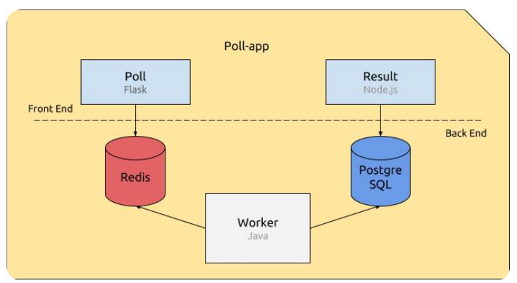

# Bernstein

A Kubernetes-based voting application with PostgreSQL as persistent storage and Redis for message queuing.

## Table of Contents

- [Architecture](#architecture)
- [Getting Started](#getting-started)
- [PostgreSQL Configuration](#postgresql-configuration)
  - [PostgreSQL Components](#postgresql-components)
  - [PostgreSQL Deployment](#postgresql-deployment)
  - [PostgreSQL Security Features](#postgresql-security-features)
  - [PostgreSQL Environment Variables](#postgresql-environment-variables)
- [Redis Configuration](#redis-configuration)
  - [Redis Components](#redis-components)
  - [Redis Deployment](#redis-deployment)
  - [Redis Security Features](#redis-security-features)
  - [Redis Environment Variables](#redis-environment-variables)
- [Poll Configuration](#poll-configuration)
  - [Poll Components](#poll-components)
  - [Poll Deployment](#poll-deployment)
  - [Poll High Availability](#poll-high-availability)
  - [Poll External Access](#poll-external-access)
- [Traefik Configuration](#traefik-configuration)
  - [Traefik Components](#traefik-components)
  - [Traefik Deployment](#traefik-deployment)
  - [Traefik High Availability](#traefik-high-availability)
  - [Traefik External Access](#traefik-external-access)
- [Project Requirements](#project-requirements)

## Architecture

The Bernstein application consists of:

- **PostgreSQL**: Persistent database for storing votes
- **Redis**: Message queue for communication between services
- **Poll**: Frontend service for voting interface
- **Worker**: Backend service for processing votes
- **Result**: Service for displaying voting results
- **Traefik**: Reverse proxy and load balancer for external access



## Getting Started

To deploy the Bernstein application on your Kubernetes cluster, follow these steps:

Clone the repository:

```bash
git clone https://github.com/Enoal-Fauchille-Bolle/Bernstein.git
cd Bernstein
```

Deploy Cadvisor for monitoring:

```bash
kubectl apply -f postgres.cadvisor.yaml
```

Deploy the PostgreSQL components:

```bash
kubectl apply -f postgres.secret.yaml
kubectl apply -f postgres.configmap.yaml
kubectl apply -f postgres.volume.yaml
kubectl apply -f postgres.deployment.yaml
kubectl apply -f postgres.service.yaml
```

Deploy the Redis components:

```bash
kubectl apply -f redis.configmap.yaml
kubectl apply -f redis.deployment.yaml
kubectl apply -f redis.service.yaml
```

Deploy the poll components:

```bash
kubectl apply -f poll.deployment.yaml
kubectl apply -f poll.service.yaml
kubectl apply -f poll.ingress.yaml
```

Deploy the worker components:

```bash
kubectl apply -f worker.deployment.yaml
```

Deploy the result components:

```bash
kubectl apply -f result.deployment.yaml
kubectl apply -f result.service.yaml
kubectl apply -f result.ingress.yaml
```

Deploy the Traefik components:

```bash
kubectl apply -f traefik.rbac.yaml
kubectl apply -f traefik.deployment.yaml
kubectl apply -f traefik.service.yaml
```

Create database manually after first deployment:

```bash
# Getting your <postgres-deployment-id>
kubectl get pods -l app=postgres -o jsonpath='{.items[0].metadata.name}'

# Getting your <postgres-container-name>
kubectl get pods -l app=postgres -o jsonpath='{.items[0].spec.containers[0].name}'

# <username> is the value of POSTGRES_USER in postgres.secret.yaml (base64 decoded)

echo "CREATE TABLE votes \
    (id text PRIMARY KEY, vote text NOT NULL);" \
    | kubectl exec -i <postgres-deployment-id> -c <postgres-container-name> \
    -- psql -U <username>
```

Adds 2 fake DNS to /etc/hosts

```bash
echo "$(kubectl get nodes -o \
    jsonpath='{ $.items[*].status.addresses[?(@.type=="ExternalIP")].address }') \
    poll.dop.io result.dop.io" \
    | sudo tee -a /etc/hosts
```

## PostgreSQL Configuration

### PostgreSQL Components

The PostgreSQL deployment consists of five main Kubernetes resources:

1. **postgres.secret.yaml**: Stores sensitive database credentials
   - `POSTGRES_USER`: Database username (base64 encoded)
   - `POSTGRES_PASSWORD`: Database password (base64 encoded)

2. **postgres.configmap.yaml**: Contains non-sensitive configuration
   - `POSTGRES_HOST`: Service hostname (postgres-service)
   - `POSTGRES_PORT`: Database port (5432)
   - `POSTGRES_DB`: Database name (postgres)

3. **postgres.volume.yaml**: Defines persistent storage
   - PersistentVolume: 5Gi storage capacity
   - PersistentVolumeClaim: Claims storage for the deployment
   - Mount path: `/var/lib/postgresql/data`

4. **postgres.deployment.yaml**: Main deployment configuration
   - Image: `postgres:12`
   - Namespace: `default`
   - Restart policy: `Always`
   - Replicas: 1 (single instance)
   - Port: 5432
   - Environment variables from Secret and ConfigMap
   - Persistent volume mounted

5. **postgres.service.yaml**: Internal service exposure
   - Type: `ClusterIP` (internal access only)
   - Port: 5432
   - Not exposed via Traefik (secure internal access)

### PostgreSQL Deployment

To deploy the PostgreSQL components:

```bash
# Apply all PostgreSQL resources
kubectl apply -f postgres.secret.yaml
kubectl apply -f postgres.configmap.yaml
kubectl apply -f postgres.volume.yaml
kubectl apply -f postgres.deployment.yaml
kubectl apply -f postgres.service.yaml

# Verify deployment
kubectl get pods -l app=postgres
kubectl get svc postgres-service
kubectl get pvc postgres-pvc
```

### PostgreSQL Security Features

- Credentials stored securely in Kubernetes Secret with base64 encoding
- Database only accessible via internal ClusterIP service
- No external exposure through Traefik ingress
- Persistent data storage with proper volume management

### PostgreSQL Environment Variables

The PostgreSQL container uses the following environment variables:

- `POSTGRES_USER`: From postgres-secret
- `POSTGRES_PASSWORD`: From postgres-secret
- `POSTGRES_DB`: From postgres-config

These variables are automatically referenced by other services in the cluster using:

- Host: `postgres-service` (from postgres-config)
- Port: `5432` (from postgres-config)

## Redis Configuration

### Redis Components

The Redis deployment consists of three main Kubernetes resources:

1. **redis.configmap.yaml**: Contains configuration data
   - `REDIS_HOST`: Service hostname (redis-service)

2. **redis.deployment.yaml**: Main deployment configuration
   - Image: `redis:5.0`
   - Namespace: `default`
   - Restart policy: `Always`
   - Replicas: 1 (single instance)
   - Port: 6379
   - No persistent storage (in-memory cache)

3. **redis.service.yaml**: Internal service exposure
   - Type: `ClusterIP` (internal access only)
   - Port: 6379
   - Not exposed via Traefik (secure internal access)

### Redis Deployment

To deploy the Redis components:

```bash
# Apply all Redis resources
kubectl apply -f redis.configmap.yaml
kubectl apply -f redis.deployment.yaml
kubectl apply -f redis.service.yaml

# Verify deployment
kubectl get pods -l app=redis
kubectl get svc redis-service

# Optional: Test Redis connectivity
kubectl apply -f redis.test.job.yaml
kubectl logs job/redis-test-job
```

### Redis Security Features

- Redis only accessible via internal ClusterIP service
- No external exposure through Traefik ingress
- Runs in default namespace with appropriate labels
- No authentication required for internal cluster communication

### Redis Environment Variables

The Redis service uses the following configuration:

- `REDIS_HOST`: From redis-config (value: `redis-service`)

Other services can connect to Redis using:

- Host: `redis-service` (from redis-config)
- Port: `6379` (default Redis port)

## Poll Configuration

### Poll Components

The Poll deployment consists of three main Kubernetes resources:

1. **poll.deployment.yaml**: Main deployment configuration
   - Image: `epitechcontent/t-dop-600-poll:k8s`
   - Namespace: `default`
   - Restart policy: `Always`
   - Replicas: 2 (high availability)
   - Port: 80
   - Memory limit: 128M
   - Environment variables from Redis ConfigMap
   - Pod anti-affinity rules for node distribution

2. **poll.service.yaml**: Internal service exposure
   - Type: `ClusterIP` (internal access)
   - Port: 80
   - Selector: `app=poll`

3. **poll.ingress.yaml**: External access configuration
   - Host: `poll.dop.io`
   - Traefik integration for external routing
   - HTTP path: `/` (root path)

### Poll Deployment

To deploy the Poll components:

```bash
# Apply all Poll resources
kubectl apply -f poll.deployment.yaml
kubectl apply -f poll.service.yaml
kubectl apply -f poll.ingress.yaml

# Verify deployment
kubectl get pods -l app=poll
kubectl get svc poll-service
kubectl get ingress poll-ingress

# Check pod distribution across nodes
kubectl get pods -l app=poll -o wide
```

### Poll High Availability

The Poll service implements high availability through:

- **2 Replicas**: Multiple instances for redundancy
- **Pod Anti-Affinity**: Ensures pods are scheduled on different nodes using `preferredDuringSchedulingIgnoredDuringExecution` with topology key `kubernetes.io/hostname`
- **Always Restart Policy**: Automatic recovery from failures
- **Memory Limits**: Resource constraints prevent resource exhaustion

### Poll External Access

The Poll service is accessible externally through:

- **Traefik Ingress**: Routes external traffic from `poll.dop.io` to the internal service
- **ClusterIP Service**: Internal load balancing between pod replicas
- **Port 80**: Standard HTTP port for web access

## Traefik Configuration

### Traefik Components

The Traefik deployment consists of three main Kubernetes resources:

1. **traefik.rbac.yaml**: Defines RBAC permissions for Kubernetes API access
   - ServiceAccount: `traefik-service-account` in `kube-public` namespace
   - ClusterRole: Permissions to read services, endpoints, secrets, and ingresses
   - ClusterRoleBinding: Links service account to cluster role

2. **traefik.deployment.yaml**: Main deployment configuration
   - Image: `traefik:3.1`
   - Namespace: `kube-public`
   - Restart policy: `Always`
   - Replicas: 2 (high availability)
   - Ports: 80 (HTTP proxy), 8080 (admin dashboard)
   - Pod anti-affinity rules for node distribution
   - Health checks with liveness and readiness probes

3. **traefik.service.yaml**: External service exposure
   - Type: `NodePort` (external access)
   - Port 80 → NodePort 30021 (HTTP proxy)
   - Port 8080 → NodePort 30042 (admin dashboard)

### Traefik Deployment

To deploy the Traefik components:

```bash
# Apply all Traefik resources
kubectl apply -f traefik.rbac.yaml
kubectl apply -f traefik.deployment.yaml
kubectl apply -f traefik.service.yaml

# Verify deployment
kubectl get pods -l app=traefik -n kube-public
kubectl get svc traefik-service -n kube-public
kubectl get serviceaccount traefik-service-account -n kube-public

# Check pod distribution across nodes
kubectl get pods -l app=traefik -n kube-public -o wide
```

### Traefik High Availability

The Traefik service implements high availability through:

- **2 Replicas**: Multiple instances for redundancy and load distribution
- **Pod Anti-Affinity**: Ensures pods are scheduled on different nodes using `preferredDuringSchedulingIgnoredDuringExecution` with topology key `kubernetes.io/hostname`
- **Always Restart Policy**: Automatic recovery from failures
- **Health Checks**: Liveness and readiness probes ensure only healthy pods receive traffic

### Traefik External Access

The Traefik service is accessible through:

- **HTTP Proxy**: External access via NodePort 30021 for routing to applications
- **Admin Dashboard**: External access via NodePort 30042 for monitoring and configuration
- **Ingress Controller**: Automatically discovers and routes traffic to ingress resources
- **Load Balancing**: Distributes traffic across multiple application instances

Access URLs:

- Poll application: `http://poll.dop.io:30021`
- Result application: `http://result.dop.io:30021`
- Traefik dashboard: `http://localhost:30042`

## Project Requirements

This configuration follows the Bernstein project specifications:

### PostgreSQL Requirements

- ✅ Uses `postgres:12` image
- ✅ Runs in `default` namespace
- ✅ Always restart policy
- ✅ Single instance (not replicated)
- ✅ Exposes port 5432
- ✅ Persistent volume mounted at `/var/lib/postgresql/data`
- ✅ Credentials in Secret, other config in ConfigMap
- ✅ Internal ClusterIP service only
- ✅ Compatible with automated testing

### Redis Requirements

- ✅ Uses `redis:5.0` image
- ✅ Runs in `default` namespace
- ✅ Always restart policy
- ✅ Single instance (not replicated)
- ✅ Exposes port 6379
- ✅ Configuration in ConfigMap
- ✅ Internal ClusterIP service only
- ✅ Not exposed via Traefik
- ✅ Compatible with automated testing

### Poll Requirements

- ✅ Uses `epitechcontent/t-dop-600-poll:k8s` image
- ✅ Runs in `default` namespace
- ✅ Always restart policy
- ✅ 2 replicas for high availability
- ✅ Exposes port 80
- ✅ Memory limit: 128M
- ✅ Environment variables from Redis ConfigMap
- ✅ Pod anti-affinity for node distribution
- ✅ Internal ClusterIP service
- ✅ External access via Traefik ingress
- ✅ Host: `poll.dop.io`

### Traefik Requirements

- ✅ Uses `traefik:3.1` image
- ✅ Runs in `kube-public` namespace
- ✅ Always restart policy
- ✅ 2 replicas for high availability
- ✅ Exposes ports 80 (HTTP proxy) and 8080 (admin dashboard)
- ✅ NodePort service exposing port 30021 (HTTP) and 30042 (dashboard)
- ✅ RBAC permissions for Kubernetes API access
- ✅ Pod anti-affinity for node distribution
- ✅ Health checks with liveness and readiness probes
- ✅ Ingress controller functionality
